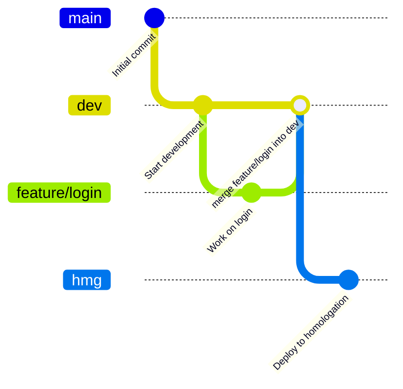

    <h2>Ministerio Atos Calendar API</h2>
    
Api de gerenciamento de eventos do Ministerio Atos

## Como rodar
1. Fork o projeto
2. Acesse o projeto
3. Configure as credenciais no application-dev.yml
4. Run no projeto com mwvn
5. Configure o H2 em memoria (modo dev)
    - Altere o JDBC URL para o mesmo do application-dev.yaml

> ![WARNING] Tenha ciencia que, o H2 é um banco estritamente para testes e desenvolvimento. Usa-lo em produção é por sua conta e risco

## Git Flow
Esse repositorio utiliza o modelo Git Flow para gerenciamento de branches e versionamento. O Git Flow é uma estratégia de ramificação que facilita o desenvolvimento colaborativo e a entrega contínua de software.
### Branches Principais
- `main`: Contém o código de produção estável. Todas as versões lançadas são
- `dev`: Contém o código em desenvolvimento. Todas as novas funcionalidades e correções são integradas aqui antes de serem lançadas.
- `hmg`: Ambiente de homologação, onde as funcionalidades são testadas antes de serem promovidas para produção.
- `feature/*`: Branches criadas a partir de `dev` para desenvolver novas funcionalidades. Após a conclusão, são mescladas de volta em `dev`.'

##### Fluxo

