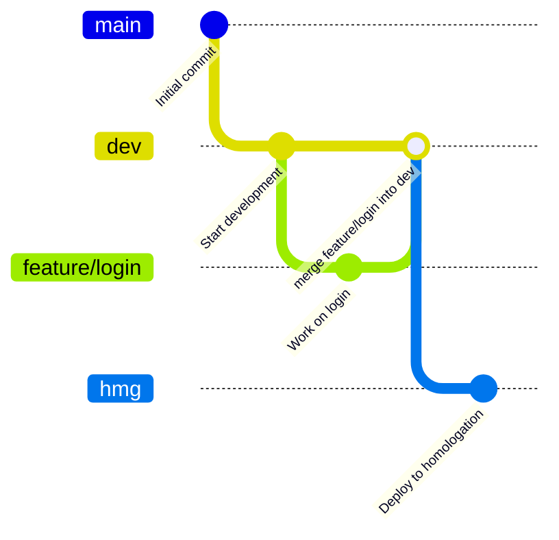

## Git Flow
Esse repositorio utiliza o modelo Git Flow para gerenciamento de branches e versionamento. O Git Flow é uma estratégia de ramificação que facilita o desenvolvimento colaborativo e a entrega contínua de software.
### Branches Principais
- `main`: Contém o código de produção estável. Todas as versões lançadas são
- `dev`: Contém o código em desenvolvimento. Todas as novas funcionalidades e correções são integradas aqui antes de serem lançadas.
- `hmg`: Ambiente de homologação, onde as funcionalidades são testadas antes de serem promovidas para produção.
- `feature/*`: Branches criadas a partir de `dev` para desenvolver novas funcionalidades. Após a conclusão, são mescladas de volta em `dev`.'

##### Fluxo
