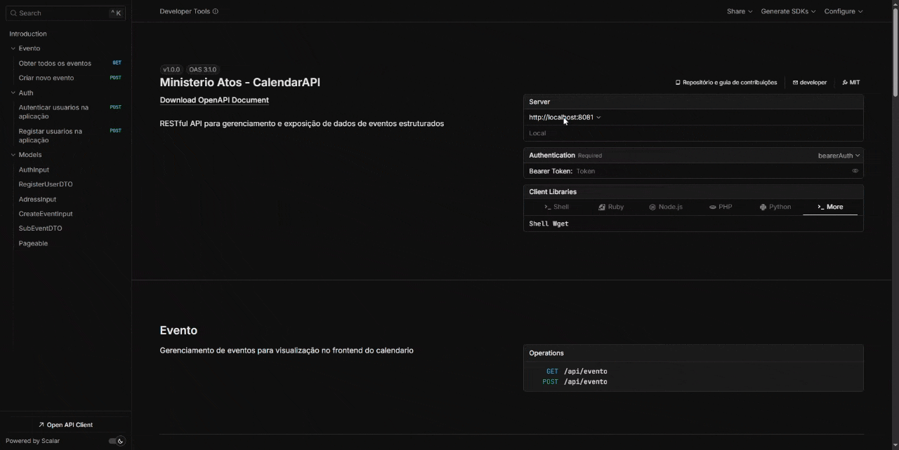
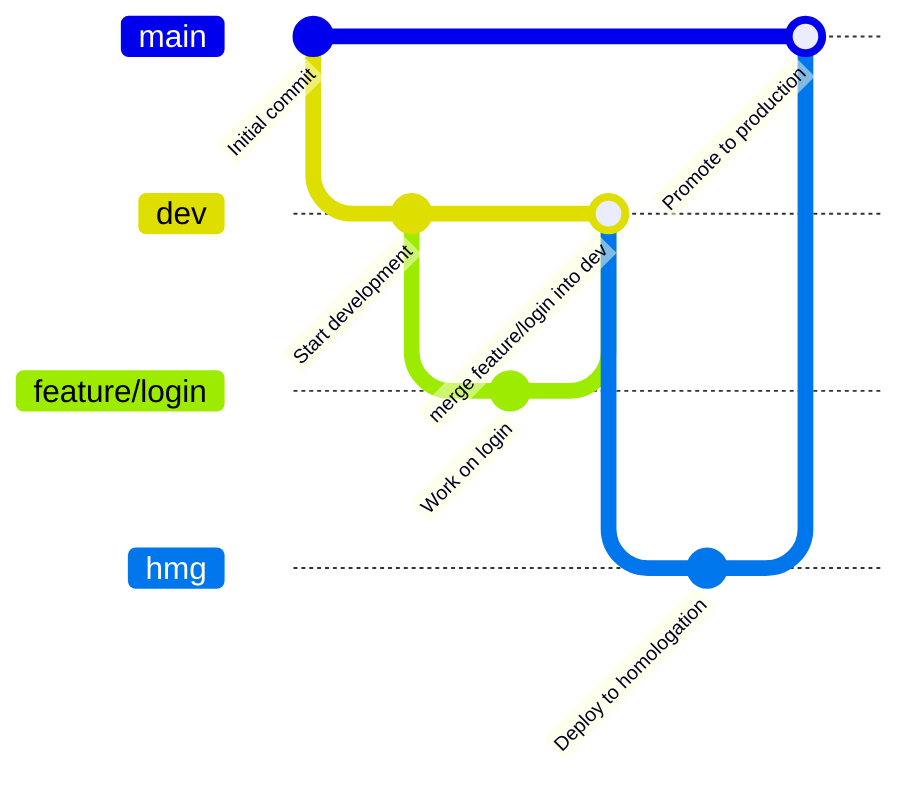

<div align="center">
    <h2>Ministerio Atos Calendar API</h2>
    <P>Api de gerenciamento de eventos da Igreja Assembleia de Deus Ministerio Atos.</P>



[Confira a demo completa aqui](https://ministerioatos-calendarapi.onrender.com/scalar)

</div>

## Estrutura do projeto

```text
└── calendarAPI
    ├── application                # Camada de aplicação
    │   ├── dto                    # Objetos de transferência de dados
    │   │   ├── address
    │   │   ├── auth
    │   │   └── event
    │   ├── mappers                # Mapeadores entre entidades e DTOs
    │   ├── service                # Serviços e casos de uso
    │   └── usecase
    ├── domain                     # Camada de domínio
    │   ├── entity
    │   ├── exceptions
    │   │   └── evento
    │   └── valueobject
    ├── infrastructure             # Camada de infraestrutura
    │   ├── config                 # Beans e configurações
    │   ├── data                   # Acesso a dados
    │   │   ├── models
    │   │   ├── repository
    │   │   └── specification
    │   ├── exception
    │   └── security               # Configurações e filtros de segurança
    └── presentation               # Camada de apresentação
        └── controller
```

## Como rodar
1. Clone o projeto e acesse a pasta do projeto
   ```bash
    git clone github.com/filoroch/ministerioatos-calendarAPI.git 
    cd ministerioatos-calendarAPI
    ```
3. Configure as credenciais locais e no application-dev.yml ou use as variaveis de ambiente padrão
   ````bash
   # Linux/Mac
    export DB_HOST=seu_host
    export DB_PORT=sua_porta
    export DB_NAME=seu_banco
    export DB_PASSWORD=sua_senha
    export DB_USER=seu_usuario
    # Windows
    set DB_HOST=seu_host
    set DB_PORT=sua_porta
    set DB_NAME=seu_banco
    set DB_PASSWORD=sua_senha
    set DB_USER=seu_usuario
   ````
4. Run no projeto com mwvn
   ```bash
    mvn spring-boot:run -Dspring-boot.run.profiles=dev
   ```
   Ou com docker
    ```bash
   docker run -d -p 8081:8081 --name calendar-api \
   -e DB_HOST=seu_host \
   -e DB_PORT=sua_porta \
   -e DB_NAME=seu_banco \
   -e DB_USER=seu_usuario \
   -e DB_PASSWORD=sua_senha \
   ```
5. Acesse o Scalar UI em http://localhost:8081/swagger-ui.html 
      
> [!WARNING]
> Tenha ciencia que, o H2 é um banco estritamente para testes e desenvolvimento. Usa-lo em produção é por sua conta e risco

## Git Flow
Esse repositorio utiliza o modelo Git Flow para gerenciamento de branches e versionamento. O Git Flow é uma estratégia de ramificação que facilita o desenvolvimento colaborativo e a entrega contínua de software.
### Branches Principais
- `main`: Contém o código de produção estável. Todas as versões lançadas são
- `dev`: Contém o código em desenvolvimento. Todas as novas funcionalidades e correções são integradas aqui antes de serem lançadas.
- `hmg`: Ambiente de homologação, onde as funcionalidades são testadas antes de serem promovidas para produção.
- `feature/*`: Branches criadas a partir de `dev` para desenvolver novas funcionalidades. Após a conclusão, são mescladas de volta em `dev`.'

##### Fluxo

